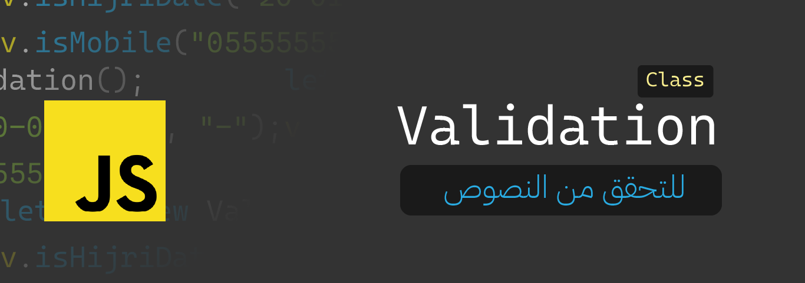

# js-validator `class`
مكتبة بسيطة جداً عبارة عن كلاس واحد وظيفتها عمل تحقق للنصوص سواء كنت أرقام ، تواريخ ، ايميلات ... وغيرها
كل دالة تحقق تعيد قيمة من نوع `boolean` إما `true` او `false` للدلالة على تحقق الشرط من عدمه.
يحتوي هذا الكلاس على ميزة التحقق من النصوص من النوع :
1. أرقام الجوال
2. التاريخ الهجري
3. البريد الإلكتروني
4. اسم المستخدم
5. كلمة المرور
6. الطول الأدنى
7. الطول الأعلى
8. الطول من الأدنى للأعلى
---
### طريقة الاستخدام :

نقوم باستيراد الكلاس لملفنا الأساسي :
````javascript
import Validator from "./Validator.js";
````
نقوم بإنشاء كائن من الكلاس :
````javascript
let v = new Validator();
````
الآن بإمكاننا استخدام دوال التحقق بالشكل التالي:
````javascript
// mobile
v.isMobile("0555555555");
// email
v.isEmail("user@domain.com");
// Hejri date
v.isHijriDate("1445-01-20", "-");
// username
v.isUsername("username");
// password
v.isPassword("pass#word$");
// minimum length
v.isMin("Hello World ... ", 10);
// maximum length
v.isMax("Hello World ... ", 10);
// minimum and maximum length
v.isMinMax("Hello World ... ", 10,20);
````